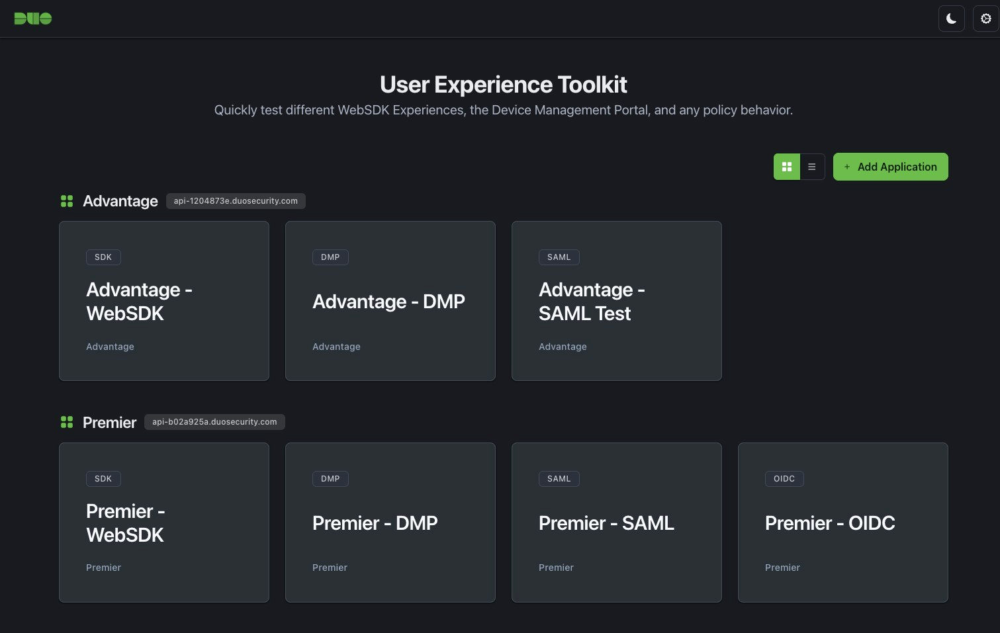
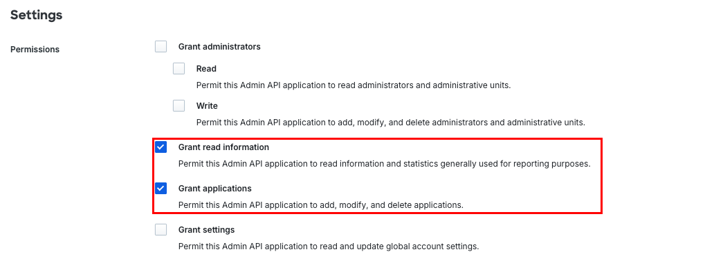

# Duo User Experience Toolkit

[](https://github.com/1broseidon/duo_uet)
[](LICENSE)
[](#docker)

Self-hosted testing platform for Duo authentication flows across WebSDK v4, Device Management Portal, SAML 2.0, and OIDC. Built for Customer Success Engineers and technical teams who need to test, demonstrate, and validate Duo authentication policies with real-world scenarios.



**Key capabilities:** Multi-tenant management · Web-based configuration · Auto-provisioning via Admin API · Policy testing · Theme-aware UI

## Quick Start

Start testing Duo authentication flows in under 60 seconds:

```bash
docker run -d \
  --name duo-uet \
  -p 8080:8080 \
  -v duo-uet-data:/app/config \
  ghcr.io/1broseidon/duo_uet:latest
```

Open `http://localhost:8080/configure` to add your Duo Admin API credentials and create test applications. Configuration persists automatically in the Docker volume.

<details>
<summary><strong>Alternative: Docker Compose</strong></summary>

For production deployments with managed volumes:

```bash
docker compose up -d
```

Uses the included `docker-compose.yml` with named volumes and health checks.
</details>

<details>
<summary><strong>Alternative: Local Directory</strong></summary>

To access the config file directly on your host:

```bash
mkdir -p duo-config
docker run -d \
  --name duo-uet \
  -p 8080:8080 \
  -v $(pwd)/duo-config:/app/config \
  ghcr.io/1broseidon/duo_uet:latest
```

Config appears at `./duo-config/config.yaml`
</details>

### What You Get

- **Multi-tenant support**: Test multiple Duo environments simultaneously
- **Auto-provisioning**: Creates applications in Duo Admin Panel via API
- **Full auth coverage**: WebSDK v4, DMP, SAML 2.0, OIDC in one interface
- **Zero config required**: Web UI handles all configuration
- **Persistent storage**: Configuration survives container restarts

## Use Cases

**For Customer Success Engineers:**
- Demonstrate different Duo authentication experiences to prospects
- Validate policy configurations before customer deployment
- Troubleshoot authentication flows with isolated test environments
- Compare behavior across WebSDK versions and SSO protocols

**For Technical Teams:**
- Integration testing for Duo authentication workflows
- CI/CD pipeline validation with automated auth testing
- Training environment for new team members
- Policy impact analysis before production rollout

**For Security Teams:**
- Audit authentication behavior across different configurations
- Test MFA policy enforcement in controlled environments
- Validate SSO metadata and claim mappings
- Security assessment of authentication flows

## Installation

### Pre-built Binaries

Download the latest release from [GitHub Releases](https://github.com/1broseidon/duo_uet/releases):

```bash
# Linux/macOS example
wget https://github.com/1broseidon/duo_uet/releases/download/v1.0.0/user_experience_toolkit_1.0.0_linux_amd64.tar.gz
tar -xzf user_experience_toolkit_1.0.0_linux_amd64.tar.gz
./uet
```

Platforms: Linux, macOS, Windows (amd64, arm64)

### From Source

Requires Go 1.25+:

```bash
git clone https://github.com/1broseidon/duo_uet.git
cd duo_uet
go mod download
go build -o uet ./cmd/uet
./uet
```

Access at `http://localhost:8080`

## How It Works

### Configuration Flow

```
┌─────────────────┐
│  1. Start App   │  Docker or binary starts with empty config
└────────┬────────┘
         │
         ▼
┌─────────────────┐
│ 2. Web UI Setup │  Navigate to /configure
└────────┬────────┘  Add Admin API credentials
         │
         ▼
┌─────────────────┐
│ 3. Auto-Create  │  Provision apps via Duo Admin API
└────────┬────────┘  Generate client IDs/secrets automatically
         │
         ▼
┌─────────────────┐
│  4. Test Flows  │  Applications appear on dashboard
└─────────────────┘  Test authentication immediately
```

Configuration is stored in `config.yaml` and persists in your Docker volume or local directory. The file is automatically created on first run and managed through the web UI.

### Config File Location

Priority order for config file resolution:

1. `UET_CONFIG_PATH` environment variable
2. `/app/config/config.yaml` (Docker default)
3. `./config.yaml` (local development)

### Admin API Permissions

When creating Admin API credentials in Duo Admin Panel, ensure the following permissions are granted:



**Required permissions:**
- ✅ **Grant read information** - Read account information and statistics
- ✅ **Grant applications** - Create, modify, and delete applications

These permissions allow the toolkit to validate credentials and auto-provision test applications.

### Advanced: Manual Configuration

For automation or GitOps workflows, edit `config.yaml` directly:

```yaml
encryption_enabled: false  # Optional: Enable AES-256-GCM encryption

tenants:
  - id: "tenant-1"
    name: "Production"
    api_hostname: "api-xxxxxxxx.duosecurity.com"
    admin_api_key: "DIXXXXXXXXXXXXXXXXXX"
    admin_api_secret: "your-secret-key"

applications:
  - id: "app-1"
    name: "WebSDK v4 Demo"
    type: "websdk"
    tenant_id: "tenant-1"
    enabled: true
    client_id: "DIXXXXXXXXXXXXXXXXXX"
    client_secret: "your-client-secret"
```

Full schema: [config.yaml.example](config.yaml.example)

### Security: Config Encryption

Protect secrets at rest with AES-256-GCM encryption:

```bash
# Enable encryption in config.yaml
encryption_enabled: true

# Provide master key via environment
export UET_MASTER_KEY="your-secure-password"

# Or use auto-generated key file (creates .uet_key with chmod 600)
./uet
```

## Supported Authentication Types

| Type | Description | Use Case |
|------|-------------|----------|
| **WebSDK v4** | Universal Prompt | Modern web applications |
| **DMP** | Device Management Portal | WebSDK v2 with device trust |
| **SAML 2.0** | Duo SSO SAML | Enterprise SSO integrations |
| **OIDC** | Duo SSO OpenID Connect | Modern SSO integrations |

Each type includes:
- Login flow simulation
- Token/claim inspection
- Success page with technical details
- Theme-aware UI

## Architecture

```
┌─────────────────────────────────────────────────────────────┐
│                         Frontend                            │
│  Bulma CSS + Design System + Theme Switcher (Light/Dark)   │
└─────────────────────────────────────────────────────────────┘
                              │
                              ▼
┌─────────────────────────────────────────────────────────────┐
│                       Go Fiber v3 API                       │
│  ┌──────────┐  ┌──────────┐  ┌──────────┐  ┌──────────┐   │
│  │ Home     │  │ Config   │  │ Auth     │  │ Admin    │   │
│  │ Handler  │  │ Handler  │  │ Flows    │  │ API      │   │
│  └──────────┘  └──────────┘  └──────────┘  └──────────┘   │
└─────────────────────────────────────────────────────────────┘
                              │
                              ▼
┌─────────────────────────────────────────────────────────────┐
│                    Config Management                        │
│  YAML Storage + Optional AES-256-GCM Encryption             │
└─────────────────────────────────────────────────────────────┘
                              │
                              ▼
┌─────────────────────────────────────────────────────────────┐
│                      Duo Integration                        │
│  Universal SDK + Admin API + SAML + OIDC Libraries          │
└─────────────────────────────────────────────────────────────┘
```

**Tech Stack:**
- **Backend:** Go 1.25, Fiber v3
- **Frontend:** Vanilla JS, Bulma CSS, Custom Design System
- **Storage:** YAML with optional encryption
- **Auth:** Duo Universal SDK, SAML 2.0, OIDC
- **Container:** Docker, Alpine Linux, multi-arch

## Development

### Local Development

```bash
# Run with auto-reload (requires air)
go install github.com/cosmtrek/air@latest
air

# Or standard go run
go run ./cmd/uet
```

### Testing

```bash
# Run all tests
go test ./...

# With coverage
go test -cover ./...
go test -coverprofile=coverage.out ./...
go tool cover -html=coverage.out
```

### Code Quality

```bash
# Format
go fmt ./...

# Vet
go vet ./...

# Static analysis (install: go install honnef.co/go/tools/cmd/staticcheck@latest)
staticcheck ./...

# Cyclomatic complexity (install: go install github.com/fzipp/gocyclo/cmd/gocyclo@latest)
gocyclo -over 15 .
```

### Pre-commit Hooks

Automatically runs tests before each commit. To bypass:
```bash
git commit --no-verify -m "message"
```

See [CONTRIBUTING.md](CONTRIBUTING.md) for development guidelines.

## Docker

### Build Locally

```bash
docker build -t duo-uet:local .

# Run with auto-generated config
docker run -d \
  -p 8080:8080 \
  -v duo-uet-local:/app/config \
  duo-uet:local
```

### Available Images

Automated builds on version tags (`v*.*.*`):
- `ghcr.io/1broseidon/duo_uet:latest` - Latest release
- `ghcr.io/1broseidon/duo_uet:v1.0.0` - Specific version
- `ghcr.io/1broseidon/duo_uet:v1.0`, `v1` - Major/minor aliases

Multi-arch support: `linux/amd64`, `linux/arm64`

### Environment Variables

- **`UET_CONFIG_PATH`** - Override config file location (default: `/app/config/config.yaml` in Docker, `./config.yaml` locally)
- **`UET_MASTER_KEY`** - Master encryption key for encrypted configs (optional)
- **`TZ`** - Timezone for logs and timestamps (default: `UTC`)

## Project Structure

```
.
├── cmd/
│   ├── uet/              # Main application entry point
│   │   ├── main.go       # Application entrypoint with embedded assets
│   │   ├── static/       # CSS, JS, images (embedded in binary)
│   │   └── templates/    # HTML templates (embedded in binary)
│   └── encrypt-config/   # Config encryption utility
├── internal/
│   ├── config/           # YAML config + encryption
│   ├── crypto/           # AES-256-GCM encryption
│   ├── handlers/         # HTTP handlers (home, config, auth flows)
│   ├── duoadmin/         # Duo Admin API client
│   ├── websdk2/          # WebSDK v2 signature generation
│   └── saml/             # SAML request/response handling
├── .github/workflows/    # CI/CD pipelines
├── .goreleaser.yml       # Multi-platform build automation
├── Dockerfile            # Local development builds
├── Dockerfile.goreleaser # CI/CD optimized builds
├── CONTRIBUTING.md       # Development guidelines
└── config.yaml.example   # Configuration template
```

## Documentation

- **[Contributing](CONTRIBUTING.md)** - Development workflow and standards
- **[Config Examples](config.yaml.example)** - Full configuration schema

## Security

- **Config Encryption:** Optional AES-256-GCM for secrets at rest
- **Non-root Container:** Runs as UID 1000 in Docker
- **Secret Management:** Supports env vars and encrypted config
- **Pre-commit Tests:** Automated testing before commits
- **Dependency Updates:** Automated via Dependabot (if configured)

**Reporting vulnerabilities:** Open a GitHub issue or contact the maintainer.

## Common Issues

### Config not persisting
```bash
# Check if volume is mounted correctly
docker inspect duo-uet | grep Mounts -A 10

# View volume contents
docker run --rm -v duo-uet-data:/data alpine ls -la /data

# Docker Compose: check volume
docker compose down
docker compose up -d
docker compose logs
```

### Config file location issues
```bash
# Check which config path is being used
docker logs duo-uet | grep "Using config file"

# Override with environment variable
docker run -e UET_CONFIG_PATH=/custom/path/config.yaml ...
```

### Docker connectivity
```bash
# Verify port isn't in use
lsof -i :8080

# Check Docker logs
docker compose logs -f

# Test health check
docker exec duo-uet wget -O- http://127.0.0.1:8080/
```

### Authentication failures
- Verify Duo credentials in config via web UI (`/configure`)
- Check redirect URI matches exactly
- Ensure server time is synchronized (JWT validation)
- Try `failmode: open` for testing

### Starting fresh
```bash
# Remove volume and start over
docker compose down -v
docker compose up -d

# Or with docker run
docker volume rm duo-uet-data
docker volume create duo-uet-data
```

## Changelog

See [CHANGELOG.md](CHANGELOG.md) for detailed version history and [GitHub Releases](https://github.com/1broseidon/duo_uet/releases) for release notes.

**Automated release notes:** When you push a version tag (e.g., `v1.0.0`), GitHub Actions automatically generates AI-powered release notes and updates the CHANGELOG.

## License

MIT © [Your Name]

## Support

- 🐛 **Issues:** [GitHub Issues](https://github.com/1broseidon/duo_uet/issues)
- 📖 **Duo Docs:** [duo.com/docs](https://duo.com/docs)
- 💬 **Questions:** Open a discussion or issue

---

**Built for Customer Success Engineers** | **Powered by Duo Security** | **Go 1.25**
